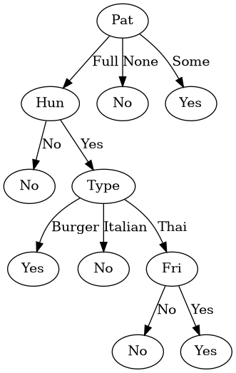

#AI-DiningDecision

A decision tree implementation using the ID3 algorithm to predict whether a person should wait for a table at a restaurant based on various conditions (e.g., hunger, type of restaurant, price, etc.).

#Features

- Reads data from a CSV file  
- Builds a decision tree using the ID3 algorithm  
- Visualizes the generated tree  
- Includes unit tests for validation

#Installation and Usage

1. Clone the repository

git clone https://github.com/MariaAccount/AI-DiningDecision.git
cd AI-DiningDecision

2. Install dependencies

pip install -r requirements.txt

3. Run the project

python create_draw_tree.py

#Example Dataset (CSV Format)

The dataset contains the number of the Example (x1,x2,...,x12) and the conditions (e.g., Alt, Bar,Fri...)

Alternate: whether there is a suitable alternative restaurant nearby.
Bar : whether the restaurant has a comfortable bar area to wait in.
Fri/Sat: true on Fridays and Saturdays.
Hungry: whether we are hungry.
Patrons: how many people are in the restaurant (values are None, Some, and Full).
Price: the restaurant’s price range ($, $$, $$$).
Raining: whether it is raining outside.
Reservation: whether we made a reservation.
Type: the kind of restaurant (French, Italian, Thai, or burger).
WaitEstimate: the wait estimated by the host (0–10 minutes, 10–30, 30–60, or >60).

| Example | Alt | Bar | Fri | Hun | Pat | Price | Rain | Res | Type  | Est   | WillWait |
|---------|-----|-----|-----|-----|-----|-------|------|-----|-------|-------|----------|
| x1      | Yes | No  | No  | Yes | Some| $$$   | No   | Yes | French| 0–10  | Yes      |
| x2      | Yes | No  | No  | Yes | Full| $     | No   | No  | Thai  | 30–60 | No       |
| x3      | No  | Yes | No  | No  | Some| $     | No   | No  | Burger| 0–10  | Yes      |

#Tree Visualization

Below is the visual representation of the decision tree generated by the ID3 algorithm:

#Running Tests

To run unit tests, use:

pytest unit_tests.py

#Technologies Used
 - Python
 - Pandas (Data Handling)
 - Graphviz (Visualization)

#Author

Maria Coelho

